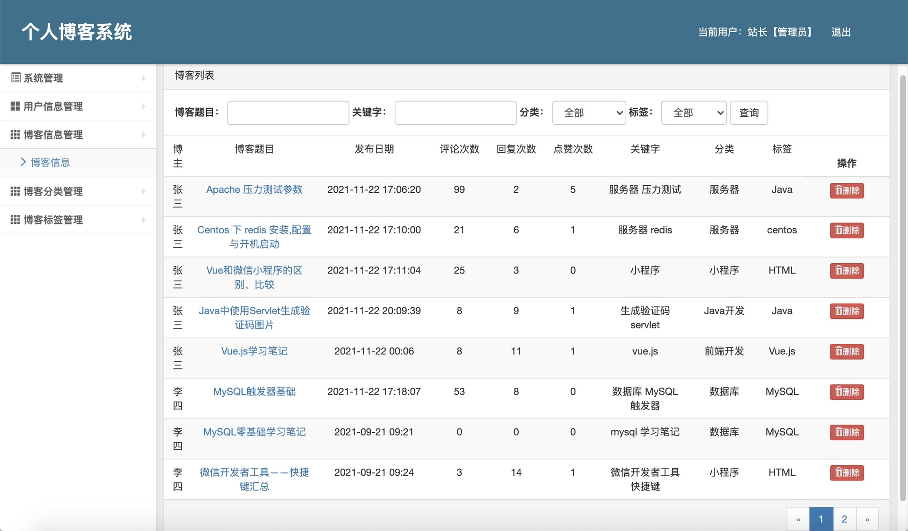

## 基于SSM实现的个人博客系统

###  获取sql数据库文件: 从戎源码网 (https://armycodes.com/) QQ: 386869957 QQ群: 377586148
###  所有系统地址: (https://github.com/YuLin-Coder/AllProjectCatalog) 
###  所有项目以及源代码本人均调试运行无问题 可支持远程安装部署调试、定制修改、代码讲解

## 项目介绍
基于SSM实现的个人博客系统，该系统主要分为前台和后台两大功能模块，共包含两种角色，分别是：用户、管理员，其功能如下：
1.前台功能
前台首页、博客浏览、分页展示博客、博客详情、博客搜索、博客分类展示、点赞博文、发表评论、关注博主、用户注册、用户登陆、个人中心、修改个人信息、修改个人主页、修改密码、博客管理、发表博文、查询/修改/删除博文、我的关注、我的粉丝、退出等功能。
2.后台功能
后台系统登陆、系统管理、用户信息管理、博客信息管理、博客分类管理、博客标签管理、修改密码等功能。

## 项目技术
- 编程语言：Java
- 数据库：MySQL
- 前端技术：JSP、JavaScript、bootstrap、JQuery
- 后端技术：Spring、SpringMVC、MyBatis

## 运行环境
- JDK版本：JDK1.8及以上
- 开发工具：IDEA、Ecplise、Myecplise都可以
- 数据库: MySQL5.7及以上
- Maven：maven3.0及以上

## 运行截图

